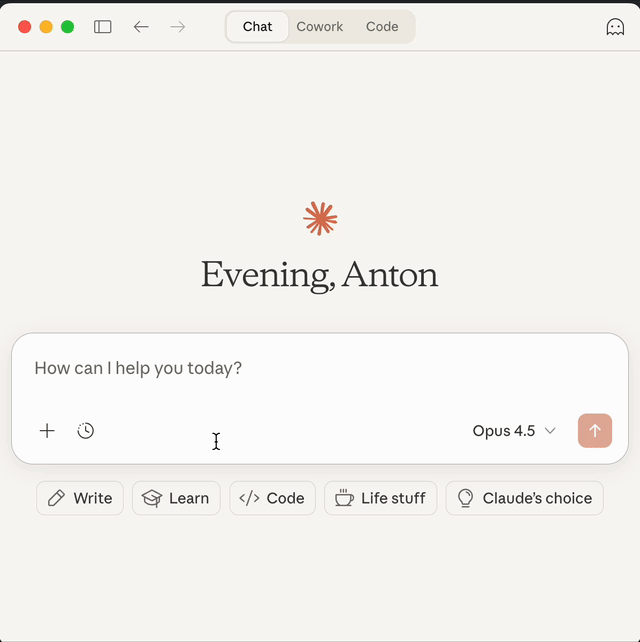

# Vehicle MCP

[](https://pypi.org/project/vehicle-mcp)

A Model Context Protocol (MCP) server for controlling your vehicle. Check battery status, control climate, lock/unlock doors, and more — from your AI assistant.



**Supported brands:**

| Brand | Uses |
|-------|------|
| Skoda | https://github.com/skodaconnect/myskoda |

## Tools

`get_vehicle_info` and `get_vehicle_status` are always available. The remaining tools are enabled based on your vehicle's detected capabilities.

| Tool | Description |
|------|-------------|
| `get_vehicle_info` | Static vehicle info (VIN, model, year, etc.) |
| `get_vehicle_status` | Current status (battery, range, location, etc.) |
| `start_climate_control` | Start heating/cooling |
| `stop_climate_control` | Stop climate control |
| `start_charging` | Start charging |
| `stop_charging` | Stop charging |
| `lock_vehicle` | Lock vehicle |
| `unlock_vehicle` | Unlock vehicle |

## Usage

Add to your MCP client configuration:

```json
{
  "mcpServers": {
    "vehicle": {
      "command": "uvx",
      "args": ["vehicle-mcp"],
      "env": {
        "BRAND": "skoda",
        "USERNAME": "your-email@example.com",
        "PASSWORD": "your-password"
      }
    }
  }
}
```

<details>
<summary>Docker</summary>

Docker images track `main` and may include unreleased changes. For stable releases, use `uvx` above.

```json
{
  "mcpServers": {
    "vehicle": {
      "command": "docker",
      "args": ["run", "-i", "--rm", "-e", "BRAND", "-e", "USERNAME", "-e", "PASSWORD", "ghcr.io/anton-lunden/vehicle-mcp"],
      "env": {
        "BRAND": "skoda",
        "USERNAME": "your-email@example.com",
        "PASSWORD": "your-password"
      }
    }
  }
}
```

</details>

| Variable | Required | Description |
|----------|----------|-------------|
| `BRAND` | Yes | Vehicle brand (`skoda`) |
| `USERNAME` | Yes | Email for your vehicle's connected services |
| `PASSWORD` | Yes | Password for your vehicle's connected services |
| `VIN` | No | Vehicle VIN (auto-detects if not set) |
| `SECURE_PIN` | For lock/unlock (Skoda) | S-PIN configured in Skoda Connect app |

## Multiple Vehicles

### Different accounts

Add multiple server entries — VIN will be auto-detected:

```json
{
  "mcpServers": {
    "my-skoda": {
      "command": "uvx",
      "args": ["vehicle-mcp"],
      "env": {
        "BRAND": "skoda",
        "USERNAME": "me@example.com",
        "PASSWORD": "my-password"
      }
    },
    "partners-skoda": {
      "command": "uvx",
      "args": ["vehicle-mcp"],
      "env": {
        "BRAND": "skoda",
        "USERNAME": "partner@example.com",
        "PASSWORD": "their-password"
      }
    }
  }
}
```

### Same account

Specify the VIN for each vehicle:

```json
{
  "mcpServers": {
    "family-car": {
      "command": "uvx",
      "args": ["vehicle-mcp"],
      "env": {
        "BRAND": "skoda",
        "USERNAME": "me@example.com",
        "PASSWORD": "my-password",
        "VIN": "TMBXXXXXXXXXXXXXX"
      }
    },
    "weekend-car": {
      "command": "uvx",
      "args": ["vehicle-mcp"],
      "env": {
        "BRAND": "skoda",
        "USERNAME": "me@example.com",
        "PASSWORD": "my-password",
        "VIN": "TMBYYYYYYYYYYYYYYY"
      }
    }
  }
}
```

## Contributing

See [CONTRIBUTING.md](CONTRIBUTING.md).
